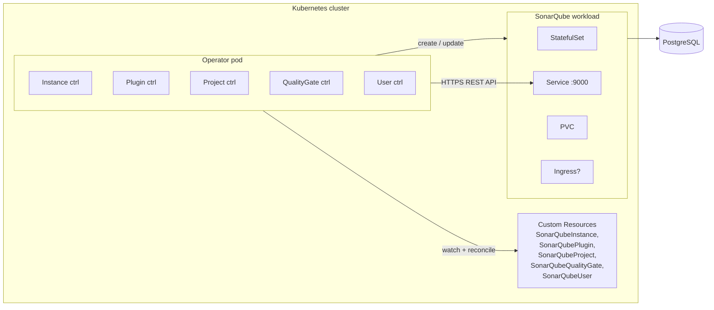
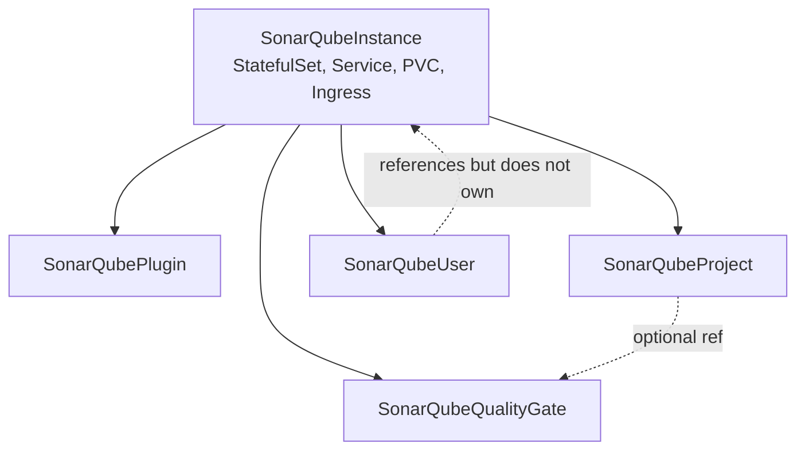

# Architecture

A walk through the moving parts of the SonarQube Operator and the
design decisions behind them. For day-to-day usage see the
[Getting Started](getting-started/index.md) section; this page is for
contributors and operators who need to understand *why* the code is
structured the way it is.

---

## High-level picture



The operator is one Deployment with five controllers (one per CRD)
running in the same binary. They share a typed Go client for the
SonarQube REST API and a small set of helpers (admin token retrieval,
internal Service URL).

---

## The reconcile loop

Every controller follows the standard
[controller-runtime](https://pkg.go.dev/sigs.k8s.io/controller-runtime)
pattern:

```go
func (r *SonarQubeProjectReconciler) Reconcile(ctx context.Context, req ctrl.Request) (ctrl.Result, error) {
    // 1. Fetch the desired state from Kubernetes
    project := &sonarqubev1alpha1.SonarQubeProject{}
    if err := r.Get(ctx, req.NamespacedName, project); err != nil {
        return ctrl.Result{}, client.IgnoreNotFound(err)
    }

    // 2. Compare desired vs actual, act
    if err := r.reconcileProject(ctx, project, instance, sonarClient); err != nil {
        return ctrl.Result{}, err
    }

    // 3. Update status, return
    return ctrl.Result{}, r.Status().Update(ctx, project)
}
```

Idempotency is non-negotiable: every reconcile must converge to the
same outcome regardless of how many times it runs, in any order. See
[Concepts → reconcile loop](getting-started/concepts.md#the-reconcile-loop)
for the user-level view.

---

## Repository layout

```text
sonarqube-operator/
├── api/v1alpha1/                    # CRD type definitions + kubebuilder markers
│   ├── sonarqubeinstance_types.go
│   ├── sonarqubeinstance_webhook.go
│   ├── sonarqubeplugin_types.go
│   ├── sonarqubeproject_types.go
│   ├── sonarqubequalitygate_types.go
│   └── sonarqubeuser_types.go
├── cmd/main.go                      # Manager entry point (registers controllers)
├── internal/
│   ├── controller/                  # Reconcile logic, one file per CRD
│   │   ├── helpers.go               # Shared helpers: phases, finalizers, instanceAPIURL
│   │   ├── sonarqubeinstance_controller.go
│   │   ├── sonarqubeplugin_controller.go
│   │   ├── sonarqubeproject_controller.go
│   │   ├── sonarqubequalitygate_controller.go
│   │   └── sonarqubeuser_controller.go
│   ├── metrics/metrics.go           # Prometheus metric definitions
│   └── sonarqube/                   # Typed REST client for SonarQube
│       ├── client.go
│       └── errors.go                # ErrNotFound sentinel + HTTP error parsing
├── config/                          # Generated Kubernetes manifests (DO NOT edit)
│   ├── crd/bases/                   # CRDs (regenerated by `make manifests`)
│   ├── rbac/                        # RBAC (regenerated by `make manifests`)
│   ├── webhook/manifests.yaml       # ValidatingWebhookConfiguration
│   └── samples/                     # Example CRs (one per CRD)
├── charts/sonarqube-operator/       # Helm chart shipped to GHCR OCI
├── docs/                            # MkDocs site (this site)
├── test/e2e/                        # End-to-end tests against a real kind cluster
├── Dockerfile                       # Multi-stage, distroless final image
└── Makefile                         # Build / test / lint / package targets
```

**Do not edit** anything under `config/crd/bases/`, `config/rbac/`, or
`zz_generated.*.go` — those are regenerated by `make manifests` and
`make generate` from the kubebuilder markers in `api/v1alpha1/`.

---

## Custom Resource hierarchy



- `SonarQubeInstance` is the root. The operator manages standard K8s
  resources to bring it up: `StatefulSet`, `Service`, optional
  `Ingress`, `PVC`, plus a Secret holding the admin Bearer token.
- The four other CRDs all reference an instance via
  `spec.instanceRef.name` (and optional `namespace`). They cannot
  function until the target instance is in `phase: Ready`.
- `SonarQubeProject.spec.qualityGateRef` is a soft reference (by name)
  to a `SonarQubeQualityGate`. Not a Kubernetes ownerRef — the gate
  can outlive any single project that references it.

---

## Key design decisions

### One CRD per SonarQube concept (instead of one mega-CRD)

Granularity buys two things:

- **RBAC scoping** — a team can be granted `sonarqubeprojects.create` in
  their namespace without getting access to instance configuration.
- **GitOps clarity** — a single PR that adds a project is one CR added,
  not a 500-line edit to a giant `SonarQubeInstance` manifest.

The cost: more controllers, slightly more reconcile traffic. Worth it.

### Finalizers, but non-blocking

Every CRD whose lifecycle has a counterpart on the SonarQube side
carries a finalizer (`sonarqube.io/<kind>-finalizer`). The operator
runs the cleanup (delete project, deactivate user, uninstall plugin)
*before* removing the finalizer.

If the SonarQube call fails — server unreachable, schema mismatch,
unexpected 500 — the operator removes the finalizer **anyway** and logs
a warning. The trade-off: an orphan SonarQube object on rare failures,
versus a Kubernetes CR stuck in `Terminating` indefinitely if SonarQube
is unhealthy. Stuck CRs are a worse failure mode in our experience.

### `Status.RestartRequired` for batched plugin restarts

A plugin install or uninstall requires a SonarQube restart to take
effect. If five `SonarQubePlugin` resources are applied at once, naive
implementations would restart SonarQube five times (each restart
costs ~1–2 minutes of downtime).

Instead, the plugin controller never restarts SonarQube directly. It
flips `instance.Status.RestartRequired = true` after a successful
install/uninstall. The instance controller, on its next reconcile,
performs **one** restart for the whole batch and clears the flag.

### `instance.Status.URL` is user-facing only

`Status.URL` is documented as the URL the user can hit (browser,
`sonar-scanner` outside the cluster). When the instance has
`spec.ingress.enabled: true`, this becomes the public Ingress hostname.

The operator's own controllers do **not** consume `Status.URL` for
their internal API calls — they go through the in-cluster Service
URL via the `instanceAPIURL(instance)` helper. This avoids the
operator pod making calls that go *out* of the cluster and back in,
which often fails on the cluster network paths.

### Owner references where possible, finalizers everywhere else

Standard Kubernetes resources owned by a `SonarQubeInstance`
(StatefulSet, Service, PVCs, Ingress, admin-token Secret) carry an
`ownerReference`. Deleting the instance garbage-collects all of them
automatically.

`PersistentVolumeClaim`s spawned by the StatefulSet are an exception —
they are intentionally left behind by the StatefulSet controller to
preserve data. The user has to delete them explicitly to wipe SonarQube
storage.

### CEL validation over webhooks where it suffices

Immutability of `spec.key` (project, plugin), `spec.login` (user) and
`spec.name` (quality gate) is enforced through
`+kubebuilder:validation:XValidation:rule="self == oldSelf"` at the
CRD level. No webhook needed — fewer moving parts, no cert-manager
dependency, validated server-side at admission time regardless of the
operator's state.

The validating webhook is reserved for cases CEL cannot express:
checking semver ordering for downgrades, for instance.

---

## Observability surface

The operator exposes:

- **Five Prometheus metrics** under the `sonarqube_*` prefix (instance
  Ready gauge, plugins installed gauge, reconcile counters and latency
  histogram per controller). See the
  [Metrics reference](reference/metrics.md).
- **Standard controller-runtime metrics** under `controller_runtime_*`
  and `workqueue_*`.
- **Kubernetes Events** on every Custom Resource for significant
  transitions: `AdminPasswordRotated`, `PluginInstalled`,
  `QualityGateConditionsCorrected`, `CITokenGenerated`, `Created`,
  `Updated`, `*Failed` — all visible via `kubectl describe`.
- **Structured zap logs** with `controller`, `name`, `namespace` and
  `reconcileID` fields for correlation.

---

## What's *not* in scope

- **PostgreSQL provisioning** — the operator references an existing
  PostgreSQL via `spec.database`. Use a dedicated Postgres operator
  (CloudNativePG, Zalando, etc.) or a managed database.
- **SonarQube Data Center clustering** — the operator manages a single
  StatefulSet replica. Multi-replica DCE clusters are out of scope.
- **Custom plugin distribution** — plugins are pulled from the
  SonarQube marketplace via `POST /api/plugins/install`. Air-gapped
  marketplace mirroring is on the post-`v1.0.0` roadmap.
- **`sonar-scanner` execution** — that's CI's job. The operator
  generates and rotates the analysis token; the rest is up to you.
