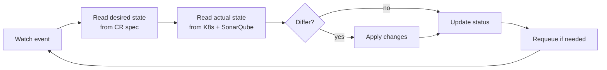
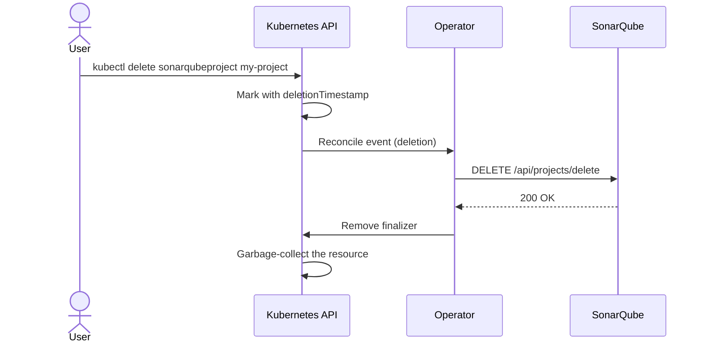

# Concepts

This page introduces the abstractions you will see throughout the rest of the
documentation. It assumes you are comfortable with core Kubernetes objects
(Pod, Service, Deployment, Secret, ConfigMap) and `kubectl`.

If you only want to install the operator and try it, jump to the
[Installation](installation.md) and [Quick Start](quick-start.md) pages.

---

## The operator pattern

A Kubernetes **operator** is a controller that extends the API with new
resource types (Custom Resources) and reconciles them against an external
system. Where a Helm chart only ships templates rendered once, an operator
*continuously* watches its custom resources and the world they describe, and
applies whatever changes are needed to converge them.

For SonarQube, that "external system" has two layers:

- The **SonarQube workload** itself — a `StatefulSet`, a `Service`, a
  `PersistentVolumeClaim`, an optional `Ingress`. Standard Kubernetes objects
  that the operator manages on your behalf.
- The **SonarQube application API** — projects, plugins, quality gates,
  users. The operator speaks SonarQube's REST API to create, update and
  delete these as your `SonarQube*` Custom Resources change.

This dual scope — Kubernetes resources *and* SonarQube application state — is
what makes the operator more than a Helm chart.

---

## The reconcile loop

Every controller in this operator implements the same loop:

The loop is triggered by:

- Changes to the Custom Resource itself (you edit a `SonarQubeProject`).
- Changes to the resources the controller owns (a Pod restarts, a Secret is
  deleted).
- A periodic requeue — every controller requeues at a sane interval so it can
  detect drift even when nothing in Kubernetes has changed.

The loop is **idempotent**: running it twice in a row with the same inputs
produces the same outputs. This is what lets the operator recover from
crashes, leader handoffs, or partial failures without leaving things in a
broken state.

---

## The five Custom Resources

The operator ships five `CustomResourceDefinitions`. Each one maps to one
concept on the SonarQube side.

| Kind | Scope | What it does |
|---|---|---|
| `SonarQubeInstance` | Namespaced | A managed SonarQube server. Provisions a `StatefulSet`, a `Service`, a `PersistentVolumeClaim` and an optional `Ingress`. Bootstraps the admin password and exposes a Bearer token in a `Secret`. |
| `SonarQubePlugin` | Namespaced | A SonarQube plugin to keep installed in a target instance. Handles install/upgrade/uninstall via the SonarQube API and asks the instance controller to schedule a restart. |
| `SonarQubeProject` | Namespaced | A SonarQube project. Manages key, name, visibility, main branch and quality gate assignment. Optionally generates a CI analysis token into a `Secret`, with rotation support. |
| `SonarQubeQualityGate` | Namespaced | A SonarQube quality gate with its conditions. Drift on conditions is detected and corrected. Can mark itself as the instance default. |
| `SonarQubeUser` | Namespaced | A SonarQube user with name, email, password and group memberships. Reconciles drift on profile fields, manages group membership without touching groups it doesn't own. |

Every CRD except `SonarQubeInstance` references a target instance through
`spec.instanceRef.name`, and lives in the same namespace as that instance.

---

## Drift detection

The operator's job is not just to *create* resources, but to keep them in the
state the spec describes. If a SonarQube administrator logs into the UI and
edits a quality gate condition, on the next reconcile the operator will
detect the discrepancy and revert it to match the spec.

This applies to:

- **Project visibility** (`SonarQubeProject`)
- **Quality gate conditions** (`SonarQubeQualityGate`) — added, removed, or
  modified conditions are all corrected.
- **Quality gate default flag** (`SonarQubeQualityGate`)
- **User profile fields** (`SonarQubeUser`) — name and email
- **Group memberships managed by the operator** (`SonarQubeUser`) — see the
  caveat below.

!!! warning "Operator-managed scope only"
    The operator never touches state it didn't create. For users, this means
    groups added through other means (the SonarQube UI, the SCIM provider,
    LDAP sync) are left alone. Only the groups listed in `spec.groups` *and*
    that the operator added itself are subject to drift correction. This
    avoids the operator fighting against your existing identity systems.

---

## Finalizers

When you `kubectl delete` a Custom Resource that the operator manages, the
SonarQube side often needs to be cleaned up first — otherwise you would leak
projects, users, or plugins on the SonarQube server.

The operator solves this with **finalizers**: a marker placed on the resource
during its creation that prevents Kubernetes from removing it until the
finalizer is cleared. The deletion sequence is:

If the SonarQube call fails — the server is unreachable, the project is
already gone, the API returns an unexpected error — the operator does
**not** block the deletion forever. It logs a warning, removes the finalizer
anyway, and lets Kubernetes proceed.

!!! info "Why non-blocking finalizers"
    A blocking finalizer that waits indefinitely for a successful API call
    would mean a single API outage on the SonarQube side could leave you
    unable to delete Kubernetes resources. The trade-off the operator makes:
    leak a SonarQube object on rare failures, never wedge the Kubernetes
    side. Operators that prefer the opposite trade-off can patch the resource
    to remove the finalizer manually and recover the same way.

---

## The SonarQube REST client

The operator never shells out to `curl` or assumes a web hook from SonarQube.
Every call to the SonarQube application API goes through a small typed Go
client with three baked-in behaviors:

- **Bearer token auth**, retrieved from a `Secret` whose name is recorded in
  `SonarQubeInstance.status.adminTokenSecretRef`. The bootstrap of this
  token from the initial admin password is the operator's responsibility.
- **Retry with exponential backoff** on transient network errors and 5xx
  responses, with a bounded retry count.
- **Distinct `ErrNotFound` sentinel** so controllers can tell "the project
  doesn't exist" apart from "the API is unreachable" — the two require very
  different actions.

The client is the only component that knows about HTTP. Controllers receive
typed Go values back, and surface meaningful Kubernetes Events when an API
call fails (`kubectl describe sonarqubeproject <name>` shows them).

---

## Status, conditions, and events

Every Custom Resource exposes its observed state in three complementary
channels:

### `status.phase`

A single coarse-grained string for at-a-glance health. For
`SonarQubeInstance`:

| Phase | Meaning |
|---|---|
| `Pending` | The instance has just been created, child resources are being provisioned. |
| `Progressing` | Pods are starting, SonarQube has not yet returned `UP` from `/api/system/status`. |
| `Ready` | SonarQube responds, the admin token is initialized, status is fully populated. |
| `Degraded` | Reserved by the CRD enum; the controller does not currently set it (a previously-Ready instance flips back to `Progressing` if SonarQube becomes unreachable). |

### `status.conditions[]`

The standard Kubernetes condition list (`type`, `status`, `reason`,
`message`, `lastTransitionTime`). This is the structured channel — what
GitOps tools and controllers themselves consume to decide whether to wait or
proceed. Every CR in this operator exposes at least a `Ready` condition.

### Kubernetes Events

Significant transitions emit Kubernetes Events visible via
`kubectl describe`. Examples:

- `AdminPasswordRotated`
- `PluginInstalled`
- `QualityGateConditionsCorrected`
- `CITokenGenerated`

Events are short-lived (one hour by default) but useful for
post-mortem debugging when something happened and you want to know when.

---

## Where to go next

- [**Installation**](installation.md) — install the operator on your cluster
- [**Quick Start**](quick-start.md) — deploy your first instance and project
- [**Reference / CRDs**](../reference/index.md) — every field of every Custom Resource
