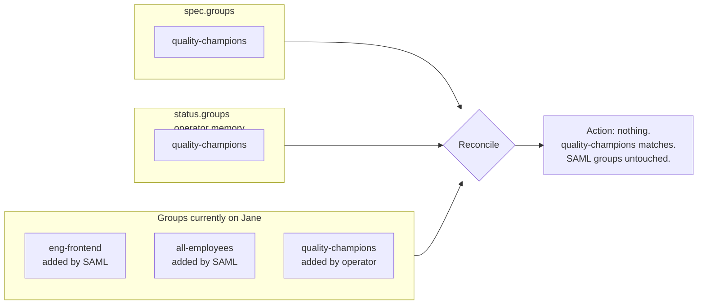

# Manage Users and Groups

The `SonarQubeUser` resource lets you provision SonarQube users
declaratively, alongside whatever identity provider you already run.
The operator follows a strict "manage what I created" rule, which lets
it coexist safely with LDAP, SAML, SCIM, or manual UI-driven group
assignments. Reference: [`SonarQubeUser`](../reference/crds/sonarqubeuser.md).

---

## Create a local user with a static password

For service / automation accounts that must authenticate with a known
password.

```yaml title="ci-bot.yaml"
apiVersion: v1
kind: Secret
metadata:
  name: ci-bot-password
  namespace: sonarqube-prod
type: Opaque
stringData:
  password: 'long-random-string-from-your-secret-store'
---
apiVersion: sonarqube.sonarqube.io/v1alpha1
kind: SonarQubeUser
metadata:
  name: ci-bot
  namespace: sonarqube-prod
spec:
  instanceRef:
    name: sonarqube
  login: ci-bot
  name: CI Bot
  email: ci-bot@example.com
  passwordSecretRef:
    name: ci-bot-password
  groups:
    - sonar-administrators
```

```bash
kubectl apply -f ci-bot.yaml
```

The user is created and added to the `sonar-administrators` group. The
secret is owner-referenced to the `SonarQubeUser`, so deleting the user
also deletes the password Secret.

---

## Create a human user with email-based password reset

For human users when SonarQube is wired to SMTP — they receive a reset
email and pick their own password.

```yaml
apiVersion: sonarqube.sonarqube.io/v1alpha1
kind: SonarQubeUser
metadata:
  name: jane-doe
  namespace: sonarqube-prod
spec:
  instanceRef:
    name: sonarqube
  login: jane.doe
  name: Jane Doe
  email: jane.doe@example.com
  # No passwordSecretRef — SonarQube generates a random password
  # and emails Jane a reset link.
  groups:
    - sonar-users
    - frontend-team
```

---

## Coexist with LDAP / SAML / SCIM

When SonarQube authenticates through an external IDP, user accounts are
provisioned by the IDP, not by the operator. You can still use
`SonarQubeUser` to manage **additional group assignments** declaratively.

```yaml
apiVersion: sonarqube.sonarqube.io/v1alpha1
kind: SonarQubeUser
metadata:
  name: jane-doe-extras
  namespace: sonarqube-prod
spec:
  instanceRef:
    name: sonarqube
  login: jane.doe                  # already exists, provisioned by SAML
  name: Jane Doe                   # informational; SAML overwrites this on next sync
  email: jane.doe@example.com
  # No passwordSecretRef — auth handled by SAML
  groups:
    - quality-champions            # extra group the operator owns
```

The "manage what I created" rule means:

- **`quality-champions`** is added by the operator (it's in `spec.groups`,
  not yet on the user). The operator records it in `status.groups`.
- **LDAP-mapped groups** (e.g. `eng-frontend`, `all-employees`) — never
  touched. They're not in `status.groups`, so the operator considers them
  "not mine".
- If you later remove `quality-champions` from `spec.groups`, the operator
  removes it from the user (because `status.groups` says it added it).
  LDAP-mapped groups stay put.



---

## Add a user to multiple groups

```yaml
spec:
  groups:
    - sonar-users
    - backend-team
    - on-call-rotation
```

The operator iterates: for each group not yet on the user, it calls
`POST /api/user_groups/add_user`. Order doesn't matter.

---

## Remove a user from a group

Delete the entry from `spec.groups[]`. The operator's "manage what I
created" rule applies:

- If the group is in `status.groups` (operator added it), it's removed.
- If the group was added externally (LDAP, SCIM, UI), it's left alone.

```yaml
spec:
  groups:
    - sonar-users
    # backend-team removed — operator removes it if it was operator-managed
```

---

## Deactivate a user

```bash
kubectl delete sonarqubeuser jane-doe -n sonarqube-prod
```

The operator calls `POST /api/users/deactivate` on the SonarQube side.
Deactivation:

- Prevents the user from logging in.
- Prevents new analyses with the user's CI tokens.
- **Preserves the audit history** — past analyses, comments, etc. remain
  attributed to the user. SonarQube has no hard-delete for users by
  design.

To reactivate, recreate the same `SonarQubeUser` with the same `login`.
SonarQube sees the existing deactivated account, reactivates it, and
restores its profile from the spec.

---

## Bulk-provision users from a directory

Generate manifests from a flat file:

```yaml title="team.yaml"
team:
  - login: jane.doe
    name: Jane Doe
    email: jane.doe@example.com
    groups: [frontend-team, quality-champions]
  - login: john.smith
    name: John Smith
    email: john.smith@example.com
    groups: [backend-team]
```

```bash
yq '.team[]' team.yaml | while read -r u; do
  cat <<EOF
---
apiVersion: sonarqube.sonarqube.io/v1alpha1
kind: SonarQubeUser
metadata:
  name: $(echo "$u" | yq '.login' | tr '.' '-')
  namespace: sonarqube-prod
spec:
  instanceRef: { name: sonarqube }
  login: $(echo "$u" | yq '.login')
  name: $(echo "$u" | yq '.name')
  email: $(echo "$u" | yq '.email')
  groups: $(echo "$u" | yq -o=json '.groups')
EOF
done | kubectl apply -f -
```

---

## Common pitfalls

- **`login` typo** — Immutable. Delete and recreate if you got it wrong.
- **Static passwords vs IDP** — `passwordSecretRef` only matters for local
  users. With LDAP/SAML, it's silently ignored on the SonarQube side.
- **Operator un-removes UI-added groups?** Won't happen. The operator
  only removes groups whose name is in `status.groups`. UI / LDAP /
  SCIM additions don't get there.
- **Operator-managed group is also LDAP-mapped** — Edge case. If LDAP
  and `spec.groups` both list the same group, the operator added it
  too on first reconcile, so its name is in `status.groups`. If you
  later remove it from `spec.groups`, the operator will remove it,
  and LDAP will re-add it on its next sync. Avoid overlap.
