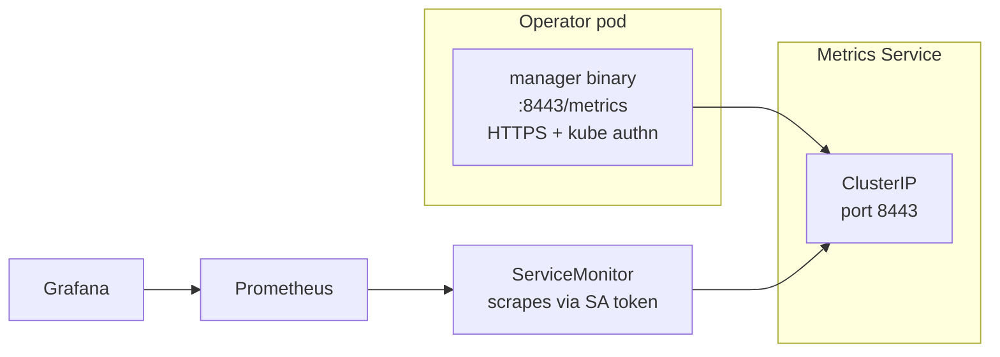

# Monitoring

This guide covers wiring the operator's metrics endpoint into a Prometheus
stack, alerting recommendations, and a baseline Grafana dashboard. The
exhaustive metric reference is in the
[Metrics reference](../reference/metrics.md).

---

## Architecture



The operator's metrics endpoint is **HTTPS-only by default**, protected
by Kubernetes authentication and authorization. Authorized scrapers
present a ServiceAccount token; the manager validates it via TokenReview
and SubjectAccessReview against the `metrics-reader` ClusterRole.

---

## Enable scraping

### With Prometheus Operator (kube-prometheus-stack)

The chart can create a `ServiceMonitor` for you:

```yaml
metrics:
  enabled: true       # default
  secure: true        # default (HTTPS + authn)
  serviceMonitor:
    enabled: true
    additionalLabels:
      release: kube-prometheus-stack   # match your Prometheus selector
    interval: 30s
    scrapeTimeout: 10s
    insecureSkipVerify: true   # operator uses self-signed certs by default
```

```bash
helm upgrade sonarqube-operator \
  oci://ghcr.io/beirdinh0s/sonarqube-operator \
  --version 0.5.0 \
  -n sonarqube-system \
  -f values.yaml
```

The Prometheus Operator's `ServiceMonitor` selector usually requires a
specific label (`release: kube-prometheus-stack` for the canonical chart).
Check your Prometheus CR's `serviceMonitorSelector`:

```bash
kubectl get prometheus -A -o jsonpath='{.items[*].spec.serviceMonitorSelector.matchLabels}'
```

### TLS hardening

`insecureSkipVerify: true` is the chart default because the operator
generates self-signed metrics certs. For production, provision a real
cert via cert-manager and pin the issuer:

```yaml
metrics:
  serviceMonitor:
    insecureSkipVerify: false
    tlsConfig:
      ca:
        secret:
          name: sonarqube-operator-metrics-ca
          key: ca.crt
      serverName: sonarqube-operator-metrics.sonarqube-system.svc
```

(This requires extending the chart to mount the metrics cert from a
Secret — see `webhook.certManager` for the pattern.)

### Without Prometheus Operator

If you scrape with a plain Prometheus configured via `prometheus.yml`,
add a scrape job:

```yaml
- job_name: sonarqube-operator
  scheme: https
  kubernetes_sd_configs:
    - role: endpoints
      namespaces:
        names: [sonarqube-system]
  bearer_token_file: /var/run/secrets/kubernetes.io/serviceaccount/token
  tls_config:
    insecure_skip_verify: true
  relabel_configs:
    - source_labels: [__meta_kubernetes_service_label_app_kubernetes_io_name]
      action: keep
      regex: sonarqube-operator
    - source_labels: [__meta_kubernetes_endpoint_port_name]
      action: keep
      regex: https
```

The Prometheus ServiceAccount needs to be bound to the
`<release>-sonarqube-operator-metrics-reader` ClusterRole:

```yaml
apiVersion: rbac.authorization.k8s.io/v1
kind: ClusterRoleBinding
metadata:
  name: prometheus-reads-sonarqube-operator
roleRef:
  apiGroup: rbac.authorization.k8s.io
  kind: ClusterRole
  name: sonarqube-operator-metrics-reader
subjects:
  - kind: ServiceAccount
    name: prometheus
    namespace: monitoring
```

---

## Recommended alerts

Drop these into a `PrometheusRule` (or your alertmanager config).

```yaml
apiVersion: monitoring.coreos.com/v1
kind: PrometheusRule
metadata:
  name: sonarqube-operator
  namespace: sonarqube-system
  labels:
    release: kube-prometheus-stack
spec:
  groups:
    - name: sonarqube.instances
      rules:
        - alert: SonarQubeInstanceNotReady
          expr: sonarqube_instance_ready == 0
          for: 5m
          labels:
            severity: critical
          annotations:
            summary: SonarQube instance {{ $labels.namespace }}/{{ $labels.name }} not Ready
            runbook: |
              kubectl describe sonarqubeinstance {{ $labels.name }} -n {{ $labels.namespace }}
              kubectl logs -n sonarqube-system -l app.kubernetes.io/name=sonarqube-operator --tail=200

    - name: sonarqube.operator
      rules:
        - alert: SonarQubeOperatorReconcileErrors
          expr: |
            sum by (controller) (rate(sonarqube_operator_reconcile_errors_total[5m]))
              /
            sum by (controller) (rate(sonarqube_operator_reconcile_total[5m]))
            > 0.05
          for: 10m
          labels:
            severity: warning
          annotations:
            summary: "{{ $labels.controller }} controller error rate >5%"
            description: |
              The {{ $labels.controller }} controller has been failing more than
              5% of reconciles for 10 minutes. Inspect the operator logs.

        - alert: SonarQubeOperatorReconcileSlow
          expr: |
            histogram_quantile(0.95,
              sum by (controller, le) (rate(sonarqube_operator_reconcile_duration_seconds_bucket[5m]))
            ) > 10
          for: 15m
          labels:
            severity: warning
          annotations:
            summary: "{{ $labels.controller }} p95 reconcile latency > 10s"

        - alert: SonarQubeOperatorWorkqueueBacklog
          expr: workqueue_depth{name=~".*sonarqube.*"} > 100
          for: 10m
          labels:
            severity: warning
          annotations:
            summary: Workqueue {{ $labels.name }} depth > 100 — operator can't keep up

        - alert: SonarQubeOperatorNoLeader
          expr: |
            sum(up{job=~".*sonarqube-operator.*"}) == 0
          for: 2m
          labels:
            severity: critical
          annotations:
            summary: No SonarQube operator pod is up
```

Tune `for:` durations to your team's tolerance. The 5m-for-NotReady is
deliberately lenient — SonarQube's startup, especially on a cold PVC, can
take 2–3 minutes.

---

## Grafana dashboard

A minimal dashboard with the four panels that matter:

1. **Instance Ready (single stat per instance)** —
   `sonarqube_instance_ready{namespace=~"$ns", name=~"$instance"}`

2. **Reconcile rate per controller** —
   `sum by (controller) (rate(sonarqube_operator_reconcile_total[5m]))`

3. **Error rate per controller** —
   `sum by (controller) (rate(sonarqube_operator_reconcile_errors_total[5m]))`

4. **p95 reconcile latency** —
   `histogram_quantile(0.95, sum by (controller, le) (rate(sonarqube_operator_reconcile_duration_seconds_bucket[5m])))`

The community-maintained dashboard (importable JSON) lives in the repo
under [`docs/operations/grafana-dashboard.json`](https://github.com/BEIRDINH0S/sonarqube-operator).
Import via **Dashboards → New → Import** and paste the JSON, or pass a
URL.

---

## Logs

The operator emits structured logs via [zap](https://pkg.go.dev/go.uber.org/zap).
Recommended pipeline:

- A log forwarder (Vector, Fluent Bit, Loki Promtail) tails the operator
  pod logs and ships them to your central store.
- Filter on `kubernetes.labels.app_kubernetes_io_name=sonarqube-operator`.
- Useful log keys: `controller`, `name`, `namespace`, `reconcileID`.

A reasonable default log level is `info`. To debug a specific issue,
bump to `debug` via the chart:

```yaml
extraArgs:
  - --zap-log-level=debug
```

…then revert the change once you have your data.
