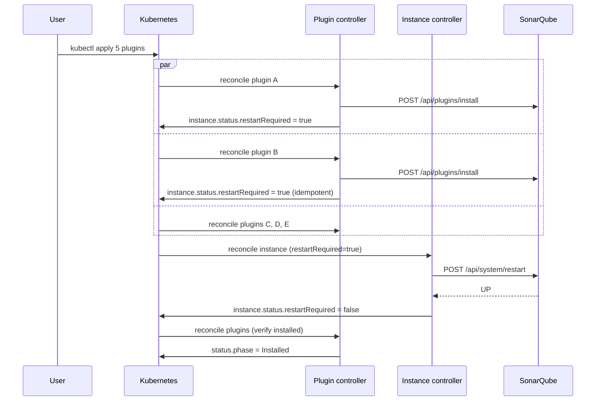

# SonarQubePlugin

A SonarQube plugin to keep installed on a target instance. The operator
handles install, upgrade, and uninstall through the SonarQube REST API and
coordinates restarts at the instance level — N plugins changed in parallel
result in a single SonarQube restart, not N.

| | |
|---|---|
| **API group** | `sonarqube.sonarqube.io` |
| **API version** | `v1alpha1` |
| **Kind** | `SonarQubePlugin` |
| **Scope** | Namespaced |

---

## Complete example

```yaml
apiVersion: sonarqube.sonarqube.io/v1alpha1
kind: SonarQubePlugin
metadata:
  name: sonar-java
  namespace: sonarqube-demo
spec:
  # Required. Reference to the SonarQubeInstance that should host this plugin.
  instanceRef:
    name: sonarqube
    # namespace defaults to the plugin's namespace if omitted.

  # Required. Plugin key as published in the SonarQube marketplace.
  # Immutable after creation.
  key: java

  # Optional. Specific version to install. If omitted, the latest available
  # version is installed.
  version: "8.2.0.36031"
```

---

## Spec

### `instanceRef`

| Field | Type | Required | Description |
|---|---|---|---|
| `name` | string | yes | Name of the target `SonarQubeInstance`. |
| `namespace` | string | no | Namespace of the target instance. Defaults to the plugin's own namespace. |

The target instance must be in the `Ready` phase before the plugin
controller will attempt anything.

### `key`

| | |
|---|---|
| **Type** | string |
| **Required** | yes |
| **Immutable** | yes (enforced via CEL XValidation) |

The plugin's marketplace key (e.g. `java`, `python`, `csharp`,
`grvy`, `scmgit`). The full catalog is available at
[https://docs.sonarsource.com/sonarqube/latest/instance-administration/marketplace/](https://docs.sonarsource.com/sonarqube/latest/instance-administration/marketplace/),
or via `GET /api/plugins/available` against your own instance.

Changing the key after creation would mean managing a different plugin —
that's almost always a mistake, so the API rejects it. Delete and recreate
if you really want to swap.

### `version`

| | |
|---|---|
| **Type** | string |
| **Required** | no |
| **Default** | latest available |

A specific version pinned in Git. Recommended for production: an unpinned
plugin version means a marketplace upgrade can change behavior without an
intentional commit.

When `version` is upgraded in the spec, the operator triggers an in-place
upgrade. Downgrades work the same way as upgrades — SonarQube does not
distinguish between the two.

---

## Status

```yaml
status:
  phase: Installed
  installedVersion: "8.2.0.36031"
  restartRequired: false
  conditions:
    - type: Ready
      status: "True"
      reason: PluginInstalled
      message: Plugin java 8.2.0.36031 installed
      lastTransitionTime: "2026-04-25T10:50:00Z"
```

### `phase`

| Phase | Meaning |
|---|---|
| `Pending` | The plugin is queued, target instance not yet `Ready`. |
| `Installing` | Install or upgrade is in progress. |
| `Installed` | The plugin is present on the target instance with the requested version. |
| `Failed` | The install/upgrade failed. Inspect `conditions` and Events for the cause. |

### Conditions vocabulary

| Type | Meaning |
|---|---|
| `Ready` | The plugin is installed and matches `spec.version`. |
| `RestartPending` | The plugin install/uninstall has been performed; SonarQube is awaiting restart from the instance controller. |

### Other status fields

| Field | Description |
|---|---|
| `installedVersion` | Version actually installed in SonarQube (read from `/api/plugins/installed`). May briefly differ from `spec.version` during an upgrade. |
| `restartRequired` | True when this plugin contributed to a pending restart. The instance controller batches multiple plugins into a single restart and clears the flag once SonarQube is back up. |

---

## Lifecycle

### Install / upgrade

1. The plugin controller calls `POST /api/plugins/install` with `key` (and
   the resolved download URL for the requested `version`).
2. SonarQube downloads the plugin JAR into the extensions directory.
3. The controller flips `instance.status.restartRequired = true`.
4. The instance controller, on its next reconcile, restarts SonarQube and
   clears the flag.
5. Once SonarQube is back up, the plugin controller verifies via
   `GET /api/plugins/installed` that the plugin is now active and updates
   `status.phase` to `Installed`.

### Restart batching

The key insight — and the reason this is a separate CRD instead of a
sub-field of `SonarQubeInstance` — is that any number of plugins can be
created/updated/deleted in parallel and only one SonarQube restart will
happen for the whole batch. The `Status.RestartRequired` flag on the
instance is the coordination point.



### Deletion

1. The `SonarQubePlugin` is marked with a `deletionTimestamp`.
2. The plugin controller calls `POST /api/plugins/uninstall`.
3. The instance is asked to schedule a restart (same flag mechanism).
4. The finalizer is removed and the resource is garbage-collected — even
   if the SonarQube call failed (non-blocking finalizer, see
   [Concepts → Finalizers](../../getting-started/concepts.md#finalizers)).

---

## Examples

### Pin the Python analyzer to a specific version

```yaml
apiVersion: sonarqube.sonarqube.io/v1alpha1
kind: SonarQubePlugin
metadata:
  name: sonar-python
  namespace: sonarqube-prod
spec:
  instanceRef:
    name: sonarqube
  key: python
  version: "4.20.0.14163"
```

### A bundle of analyzers, GitOps style

Drop these in a directory of your GitOps repo and Argo / Flux applies the
batch — the operator does a single SonarQube restart for the whole set.

```yaml title="plugins-stack.yaml"
apiVersion: sonarqube.sonarqube.io/v1alpha1
kind: SonarQubePlugin
metadata:
  name: java
spec:
  instanceRef: { name: sonarqube }
  key: java
  version: "8.2.0.36031"
---
apiVersion: sonarqube.sonarqube.io/v1alpha1
kind: SonarQubePlugin
metadata:
  name: javascript
spec:
  instanceRef: { name: sonarqube }
  key: javascript
  version: "10.13.0.27796"
---
apiVersion: sonarqube.sonarqube.io/v1alpha1
kind: SonarQubePlugin
metadata:
  name: typescript
spec:
  instanceRef: { name: sonarqube }
  key: typescript
  version: "10.13.0.27796"
```

### Latest version (not recommended for production)

```yaml
apiVersion: sonarqube.sonarqube.io/v1alpha1
kind: SonarQubePlugin
metadata:
  name: sonar-go
  namespace: sonarqube-staging
spec:
  instanceRef:
    name: sonarqube
  key: go
  # version omitted -> install latest
```

The operator records the resolved version in
`status.installedVersion` so you can always tell what was actually picked.
