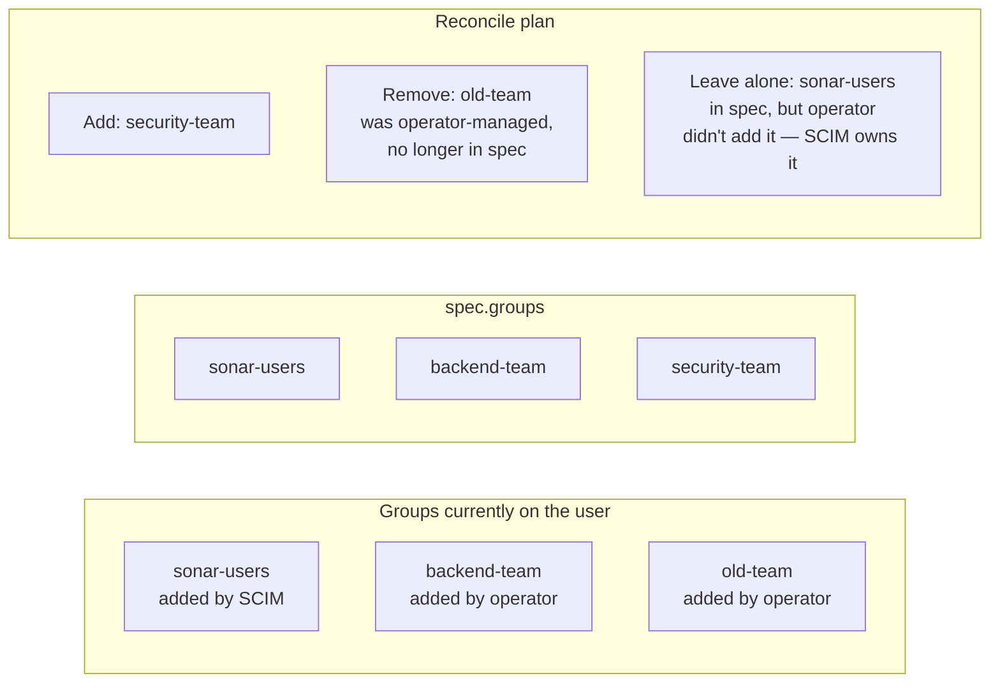

# SonarQubeUser

A SonarQube user managed declaratively. The operator creates the user with
the requested profile and password, keeps name/email in sync with the spec,
and manages group memberships — but only those groups it has explicitly
added.

| | |
|---|---|
| **API group** | `sonarqube.sonarqube.io` |
| **API version** | `v1alpha1` |
| **Kind** | `SonarQubeUser` |
| **Scope** | Namespaced |

---

## Complete example

```yaml
apiVersion: sonarqube.sonarqube.io/v1alpha1
kind: SonarQubeUser
metadata:
  name: john-doe
  namespace: sonarqube-prod
spec:
  # Required. Reference to the SonarQubeInstance hosting this user.
  instanceRef:
    name: sonarqube

  # Required. SonarQube login. Immutable after creation.
  login: john.doe

  # Required. Display name shown in the UI.
  name: John Doe

  # Optional. Email address. Drift-corrected on every reconcile.
  email: john.doe@example.com

  # Optional. Reference to a Secret with the initial password under key "password".
  # If omitted, SonarQube generates a random password and the user must reset
  # via email.
  passwordSecretRef:
    name: john-doe-password

  # Optional. Groups the operator should ensure this user belongs to.
  # The operator only adds/removes groups it has previously assigned itself —
  # see "Operator-managed groups" below.
  groups:
    - sonar-users
    - backend-team

  # Optional. SCM identities (Git committer emails / names) linked to this
  # user. Set semantics: SonarQube's SCM account list is replaced by this
  # list on each reconcile.
  scmAccounts:
    - john.doe@example.com
    - jdoe@github

  # Optional. Standalone user tokens stored in Kubernetes Secrets.
  # Independent of any project — for personal automation, read-only API
  # access, or a global analysis token.
  tokens:
    - name: read-only-api
      type: USER_TOKEN
      secretName: john-doe-readonly-token
      expiresIn: 8760h               # optional, 1 year
    - name: global-analysis
      type: GLOBAL_ANALYSIS_TOKEN
      secretName: org-analysis-token

  # Optional. Instance-wide permissions granted to this user.
  # The operator only ever revokes grants it created (tracked via
  # status.managedGlobalPermissions).
  globalPermissions:
    - scan
    - profileadmin
```

---

## Spec

### `instanceRef`

| Field | Type | Required | Description |
|---|---|---|---|
| `name` | string | yes | Name of the target `SonarQubeInstance`. |
| `namespace` | string | no | Defaults to the user's own namespace. |

### `login`

| | |
|---|---|
| **Type** | string |
| **Required** | yes |
| **Min length** | 2 |
| **Immutable** | yes (enforced via CEL XValidation) |

The unique SonarQube login. Used everywhere the user is referenced — group
memberships, project permissions, audit log entries. Once a user has any
SonarQube history, changing the login would orphan it, so the API rejects
updates.

### `name`

| | |
|---|---|
| **Type** | string |
| **Required** | yes |
| **Min length** | 1 |

Display name in the SonarQube UI. Drift-corrected.

### `email`

| | |
|---|---|
| **Type** | string |
| **Required** | no |

Email address. Used by SonarQube for password reset and notifications.
Drift-corrected.

### `passwordSecretRef`

| | |
|---|---|
| **Type** | `LocalObjectReference` |
| **Required** | no |

Reference to a Secret in the same namespace containing the user's initial
password under the key `password`.

When set, the operator uses this password during the initial user creation.
**It is not used for ongoing rotation** — changing the value in the Secret
after the user exists has no effect.

When **omitted**, SonarQube generates a random password the user has to
reset through the email link. This is the recommended path when SonarQube
is hooked up to SMTP and your users actually receive the reset emails.

!!! note "Local users only"
    `passwordSecretRef` only matters for SonarQube **local** users. If
    your SonarQube authenticates through SAML, LDAP, or an OAuth provider,
    user accounts are provisioned by the identity layer, not by this
    field — but you can still use `SonarQubeUser` to manage their group
    memberships.

### `groups`

| | |
|---|---|
| **Type** | `[]string` |
| **Required** | no |

List of SonarQube group names the user should be a member of.

#### Operator-managed groups

The operator follows a strict "manage what I created" rule for group
membership. On every reconcile:

1. Compute `previously_managed = status.groups` (groups the operator added
   in past reconciles).
2. Compute `desired = spec.groups`.
3. **Add** every group in `desired \ live_groups` (not yet on the user).
4. **Remove** every group in `previously_managed \ desired` (groups the
   operator added once, that are no longer in the spec).
5. **Never touch** groups in `live_groups \ (previously_managed ∪ desired)` —
   those were added by another tool (LDAP sync, SCIM, manual UI), and
   they're not the operator's concern.
6. Update `status.groups` to the new managed set.



This means the operator can coexist safely with LDAP / SAML group sync,
SCIM provisioners, and manual UI grants. It will never fight to remove a
group it didn't add.

### `scmAccounts`

| | |
|---|---|
| **Type** | `[]string` |
| **Required** | no |

The SCM identities (Git committer emails, GitHub handles, internal usernames…)
SonarQube should attribute analysis findings to. When a `git blame` line in
an analyzed project resolves to one of these identities, SonarQube credits
the issue to this user — useful for the *author of the issue* facet, the
*new code introduced by* metric, and personal dashboards.

**Set semantics**: on each reconcile, SonarQube's SCM account list for
this user is replaced by `spec.scmAccounts`. Pass an empty list (or omit
the field once it was previously set) to clear all accounts. There is no
per-account opt-out — the field is fully owned by the operator.

Common entries: the user's primary commit email, alternate emails (work
vs. personal), and any internal usernames pre-dating consistent email
hygiene.

### `tokens`

| | |
|---|---|
| **Type** | `[]UserToken` |
| **Required** | no |

Standalone SonarQube user tokens, each materialized as its own Kubernetes
Secret in the user's namespace. Distinct from `SonarQubeProject.spec.ciToken`
(which is a per-project analysis token tied to the project's lifecycle):
these are user-scoped tokens for personal automation, read-only API access,
or a global-analysis token shared by many CI pipelines.

| Field | Type | Required | Default | Description |
|---|---|---|---|---|
| `name` | string | yes | — | SonarQube-side token name. Must be unique per user. |
| `type` | enum | no | `USER_TOKEN` | `USER_TOKEN` (full user permissions) or `GLOBAL_ANALYSIS_TOKEN` (analysis-only, no read of the rest of the API). |
| `secretName` | string | yes | — | Name of the Kubernetes Secret to store the token under the key `token`. |
| `expiresIn` | duration | no | — (no expiry) | Optional Go-style duration: `720h` (30 days), `8760h` (1 year). Passed through to SonarQube as the token's `expirationDate`. |

The operator follows "manage what I created": only token names that
appear in `status.managedTokens` are revoked when they leave the spec.
Tokens generated through the SonarQube UI are never touched.

**Rotation**: delete the Secret to force the operator to regenerate the
token on the next reconcile (the previous SonarQube-side token is
revoked as part of the same cycle). The operator does **not** auto-rotate
before `expiresIn` — see the [Token Rotation guide](../../how-to/token-rotation.md)
for scheduled-rotation patterns.

### `globalPermissions`

| | |
|---|---|
| **Type** | `[]string` |
| **Required** | no |

Instance-wide permissions granted to this user. Valid values:

| Permission | Effect |
|---|---|
| `admin` | Full instance administration. Use sparingly. |
| `gateadmin` | Create / edit / delete quality gates. |
| `profileadmin` | Create / edit / delete quality profiles. |
| `provisioning` | Create new projects. |
| `scan` | Execute analysis. The default permission for CI bots. |

The operator follows "manage what I created": only grants that appear in
`status.managedGlobalPermissions` are revoked when they leave the spec.
Permissions assigned through the SonarQube UI are never removed.

!!! warning "`admin` is highly privileged"
    A user with `admin` can change the admin password, install plugins,
    manage all users and groups, and see every project regardless of
    visibility. Prefer narrow, role-based grants (`gateadmin`,
    `profileadmin`) and reserve `admin` for break-glass accounts.

---

## Status

```yaml
status:
  phase: Ready
  active: true
  groups:
    - sonar-users     # added by the operator on a previous reconcile
    - backend-team
  conditions:
    - type: Ready
      status: "True"
      reason: UserInSync
      message: User john.doe matches spec
      lastTransitionTime: "2026-04-25T11:10:00Z"
```

### `phase`

| Phase | Meaning |
|---|---|
| `Pending` | Target instance not yet `Ready`, or initial creation in progress. |
| `Ready` | User exists, profile and managed groups match spec. |
| `Failed` | A SonarQube API call failed. |

### Other status fields

| Field | Description |
|---|---|
| `active` | Whether the user account is currently active in SonarQube. False after deletion (operator deactivates rather than hard-deletes). |
| `groups` | Groups the operator has assigned. Used for the "manage what I created" diff (see above). Never edit by hand. |
| `managedTokens` | Names of standalone tokens the operator generated for this user. Names removed from `spec.tokens` but still in this list are revoked on the next reconcile. Never edit by hand. |
| `managedGlobalPermissions` | Global permissions the operator granted to this user. Permissions no longer in `spec.globalPermissions` are revoked on the next reconcile. Never edit by hand. |

---

## Lifecycle

### Creation

1. `POST /api/users/create` with login, name, email, optional password.
2. For each group in `spec.groups`, `POST /api/user_groups/add_user`.
3. `status.groups` set to the same list (records what the operator added).
4. `status.phase = Ready`.

### Updates

Drift correction applies on each reconcile:

| Field | Behavior |
|---|---|
| `name`, `email` | Live values fetched, compared to spec, corrected via `POST /api/users/update`. |
| `groups` | Three-way diff (see [Operator-managed groups](#operator-managed-groups)). |

### Deletion

1. Resource marked with `deletionTimestamp`.
2. The operator **deactivates** the user via
   `POST /api/users/deactivate?login=<login>` rather than hard-deleting.
   Deactivation preserves audit history while preventing further sign-in
   and analysis runs.
3. The Secret holding the initial password (if any) is owner-referenced
   and garbage-collected automatically.
4. Finalizer removed.

!!! note "Reactivating a user"
    Re-applying the same `SonarQubeUser` after deletion reactivates the
    SonarQube account (it still exists, just deactivated). All previous
    permissions and group memberships are restored as part of the
    reconcile.

---

## Examples

### Service account user with a static password

For CI / automation accounts that authenticate with a known password.

```yaml
apiVersion: v1
kind: Secret
metadata:
  name: ci-bot-password
  namespace: sonarqube-prod
type: Opaque
stringData:
  password: '<long-random-string-from-your-secret-store>'
---
apiVersion: sonarqube.sonarqube.io/v1alpha1
kind: SonarQubeUser
metadata:
  name: ci-bot
  namespace: sonarqube-prod
spec:
  instanceRef:
    name: sonarqube
  login: ci-bot
  name: CI Bot
  email: ci-bot@example.com
  passwordSecretRef:
    name: ci-bot-password
  groups:
    - sonar-administrators   # CI bot needs admin
```

### Human user, password reset by email

When SonarQube is wired to SMTP and you trust your team to set their own
password.

```yaml
apiVersion: sonarqube.sonarqube.io/v1alpha1
kind: SonarQubeUser
metadata:
  name: jane-doe
  namespace: sonarqube-prod
spec:
  instanceRef:
    name: sonarqube
  login: jane.doe
  name: Jane Doe
  email: jane.doe@example.com
  groups:
    - sonar-users
    - frontend-team
```

### LDAP-provisioned user, operator manages only group additions

When users come from your LDAP directory (so login + name + email are
authoritative there), but you still want declarative *additional* group
assignment via Git.

```yaml
apiVersion: sonarqube.sonarqube.io/v1alpha1
kind: SonarQubeUser
metadata:
  name: jane-doe
  namespace: sonarqube-prod
spec:
  instanceRef:
    name: sonarqube
  login: jane.doe
  name: Jane Doe                          # mostly cosmetic — LDAP wins on next sync
  email: jane.doe@example.com             # idem
  # No passwordSecretRef — LDAP authenticates.
  groups:
    - quality-champions   # extra group the operator owns
```

The operator will never remove the LDAP-mapped groups from this user, even
if they're not in the spec — see [Operator-managed groups](#operator-managed-groups).
